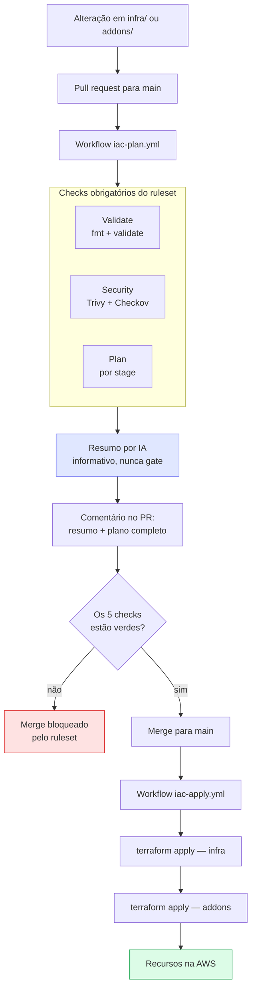
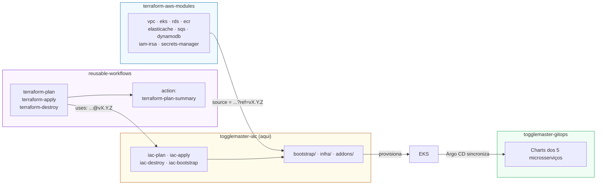
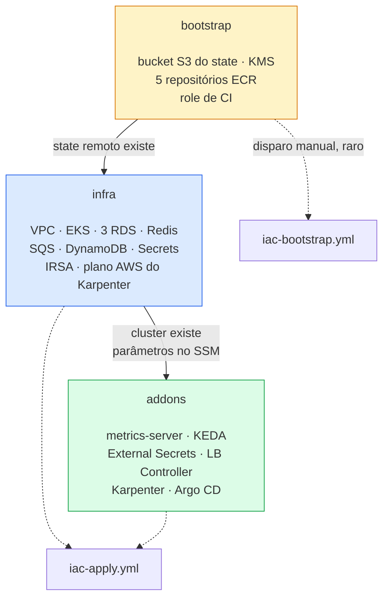
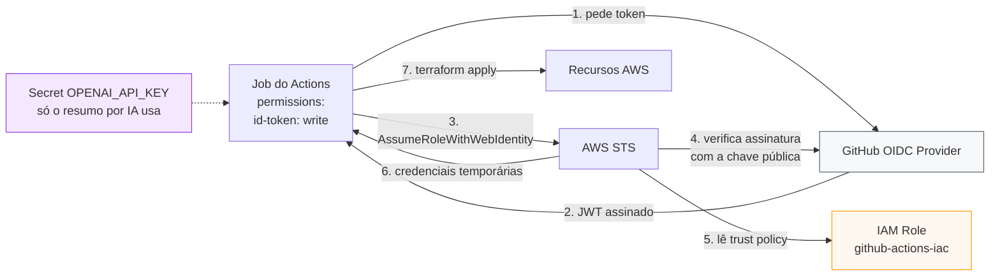
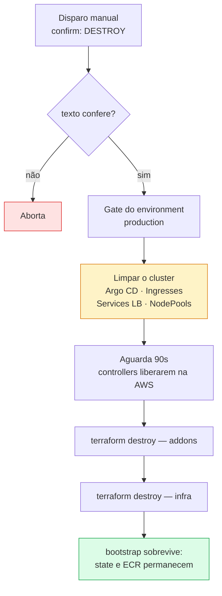

# A esteira — Terraform e GitHub Actions

Como o código deste repositório vira infraestrutura na AWS, e quem autoriza cada passo.

Os diagramas são Mermaid dentro do Markdown: o GitHub renderiza sozinho, e uma mudança neles aparece no diff como qualquer outra linha de código.

---

## 1. De um pull request até a AWS

O caminho que um commit percorre. Nenhuma etapa é opcional.



**O gate é o pull request, e só ele.** O `apply` não tem aprovação própria: quem aprova o PR já decidiu aplicar, e foi a única pessoa que teve o plano na frente para ler. Exigir um segundo `approve` no environment aprovaria a mesma decisão duas vezes — e um apply parado nesse portão segurava o grupo de `concurrency`, enfileirando os merges seguintes.

O `destroy` é a exceção: roda por disparo manual, sem PR e sem plano, então mantém o gate de environment como única confirmação humana.

---

## 2. Os quatro repositórios

Cada seta é uma referência fixada em **tag**, nunca em `main`.



**Por que tag e não `main`:** um commit na biblioteca não pode alterar o plano deste repositório sem uma mudança explícita aqui. Se a referência fosse `main`, o mesmo commit produziria planos diferentes em dias diferentes.

Isso já mordeu: uma tag criada **antes** do commit que acrescentava os workflows fez o `apply` falhar sem criar nenhum job — o GitHub não conseguia resolver a referência. Ordem correta: commit, push, e só então a tag.

---

## 3. Os três stages e por que são três



| stage | por que é separado |
|---|---|
| **bootstrap** | Ovo e galinha: o bucket que guarda o `tfstate` não pode guardar o state que o cria. Roda com state local na primeira execução e depois migra o próprio state para o bucket. O ECR vive aqui para a CI dos microsserviços ser testável sem subir a infraestrutura, e para as imagens sobreviverem ao `destroy`. |
| **infra** | Usa só o provider `aws` e cabe num apply só. |
| **addons** | Precisa dos providers `helm` e `kubernetes` apontando para um cluster que só existe depois do `infra`. O Terraform não permite que a configuração de um provider dependa de recursos do mesmo apply — daí o state próprio. |

---

## 4. Quem autoriza o quê

Nenhum segredo de longa duração da AWS existe neste repositório.



A trust policy da role restringe por `sub`. Esta organização usa a claim `sub` customizada do GitHub, que injeta IDs imutáveis:

```
repo:fiap-tech-challenge-devops@283760261/togglemaster-iac@1314140933:ref:refs/heads/main
```

O padrão clássico `repo:<org>/<repo>:*` **não casa** com isso — o sufixo `@<id>` aparece antes da barra, onde o curinga final não alcança. O sintoma é `Not authorized to perform sts:AssumeRoleWithWebIdentity` com a trust policy parecendo correta.

Detalhe geral do OIDC, sem os nomes deste projeto: [board no Miro](https://miro.com/app/board/uXjVHxnRqDY=/).

---

## 5. O caminho de volta — destroy

A ordem é o inverso, e o primeiro passo não é Terraform.



**Por que limpar o cluster antes.** Load balancers criados pelo AWS Load Balancer Controller e nós criados pelo Karpenter **não estão no `tfstate`** — quem os cria são controllers rodando dentro do cluster. Se sobreviverem, ficam órfãos e seguram a VPC: o `terraform destroy` trava em `DependencyViolation` ao remover as subnets.

O Argo CD sai primeiro porque, se ficar de pé, ele recria tudo o que for apagado em seguida.
